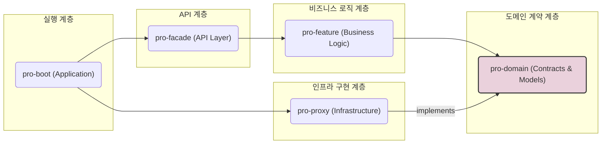

# pro 프로젝트 아키텍처 설계

## 1. 개요

이 문서는 `pro` 프로젝트의 소프트웨어 아키텍처를 설명합니다.

본 프로젝트는 **헥사고날 아키텍처(Hexagonal Architecture)**, 또는 포트와 어댑터(Ports and Adapters) 아키텍처 원칙을 기반으로 설계되었습니다. 이 설계의 핵심 목표는 비즈니스 로직을 외부 기술(UI, 데이터베이스, 외부 API 등)로부터 분리하여, 유연하고 테스트하기 쉬우며 유지보수성이 높은 시스템을 구축하는 것입니다.

## 2. 핵심 설계 원칙

### 가. 의존성 역전 원칙 (Dependency Inversion Principle, DIP)

> "고수준 모듈은 저수준 모듈에 의존해서는 안 된다. 둘 모두 추상화에 의존해야 한다."

이 프로젝트에서 가장 중요하게 적용된 원칙입니다.

- **고수준 모듈 (비즈니스 로직):** `pro-feature`
- **저수준 모듈 (구현 기술):** `pro-proxy` (DB, 외부 API 연동)
- **추상화:** `pro-domain` (인터페이스)

`pro-feature`는 `pro-proxy`를 직접 알지 못하며, 오직 `pro-domain`에 정의된 '계약'(인터페이스)에만 의존합니다. 이를 통해 데이터베이스나 외부 API 기술이 변경되더라도 핵심 비즈니스 로직은 영향을 받지 않습니다.

### 나. 관심사의 분리 (Separation of Concerns)

각 모듈은 명확하게 정의된 하나의 책임만 가집니다.

- **Domain:** 무엇을 할 것인가 (비즈니스 규칙과 계약)
- **Feature:** 왜, 언제 할 것인가 (순수 비즈니스 로직)
- **Proxy:** 어떻게 할 것인가 (기술적인 구현)
- **Facade:** 누가 요청하는가 (외부와의 상호작용)
- **Boot:** 어떻게 시작할 것인가 (모든 모듈의 조립 및 실행)

## 3. 아키텍처 다이어그램

아래 다이어그램은 모듈 간의 컴파일 시점 의존성 방향을 보여줍니다. 모든 화살표는 의존하는 쪽에서 의존되는 쪽을 향하며, 중앙의 `pro-domain`을 향하는 구조입니다.

## 4. 모듈별 역할과 책임

### 가. `pro-domain`
- **역할:** 프로젝트의 가장 핵심이 되는 비즈니스 규칙과 모델, 그리고 '계약'(인터페이스)을 정의합니다.
- **특징:** 순수한 Java 객체(POJO)로만 구성되며, 특정 기술(@Entity, @Service 등)에 대한 어노테이션이나 의존성이 전혀 없습니다.
- **예시:** `User` (도메인 모델), `UserStore` (인터페이스), `KeycloakSyncService` (인터페이스)

### 나. `pro-feature`
- **역할:** 순수한 비즈니스 로직과 서비스들을 포함합니다.
- **특징:** `pro-domain`에 정의된 인터페이스를 주입받아 비즈니스 흐름을 제어합니다. `pro-proxy` 등 구체적인 구현 기술에 대해서는 전혀 알지 못합니다.
- **예시:** `UserService`

### 다. `pro-proxy`
- **역할:** `pro-domain`의 인터페이스에 대한 실제 구현체를 제공합니다.
- **특징:** 데이터베이스 연동(JPA), 외부 API 클라이언트(Keycloak) 등 기술 종속적인 코드가 모두 이 모듈에 위치합니다. `@Repository`, `@Service`, `@Entity` 등의 어노테이션이 사용됩니다.
- **예시:** `UserJpaStore`, `KeycloakAdminClientServiceImpl`

### 라. `pro-facade`
- **역할:** 외부 세계(주로 Web)와의 접점 역할을 합니다.
- **특징:** HTTP 요청을 받아 `pro-feature`의 서비스를 호출하고, 그 결과를 HTTP 응답으로 변환합니다. `@RestController`가 주로 사용됩니다.

### 마. `pro-boot`
- **역할:** 모든 모듈을 조립하고 애플리케이션을 실행하는 최종 진입점입니다.
- **특징:** `@SpringBootApplication`이 위치하며, 모든 의존성을 포함하여 스프링의 의존성 주입(DI)이 올바르게 동작하도록 설정합니다.

## 5. 실제 적용 예시: `KeycloakSyncService`

이 아키텍처가 실제로 어떻게 동작하는지 `KeycloakSyncService`의 흐름을 통해 알 수 있습니다.

1.  **계약:** `pro-domain` 모듈의 `KeycloakSyncService` 인터페이스가 `syncUser`라는 '계약'을 정의합니다.
2.  **사용:** `pro-feature` 모듈의 특정 서비스는 생성자를 통해 `KeycloakSyncService` 인터페이스를 주입받아 `syncUser` 메서드를 호출합니다. 이 서비스는 실제 구현에 대해서는 아는 바가 없습니다.
3.  **구현:** `pro-proxy` 모듈의 `KeycloakAdminClientServiceImpl` 클래스가 `KeycloakSyncService` 인터페이스를 구현하고, 실제 Keycloak API 통신 로직을 작성합니다. 이 클래스는 `@Service`로 등록됩니다.
4.  **조립:** `pro-boot`이 애플리케이션을 실행하면, 스프링 컨테이너는 `pro-feature`의 서비스가 `KeycloakSyncService`를 필요로 하는 것을 인지하고, `@Service`가 붙은 `KeycloakAdminClientServiceImpl` 구현체를 찾아 자동으로 주입해줍니다.

이러한 흐름을 통해 비즈니스 로직과 구현 기술이 완벽하게 분리되어 동작합니다.
