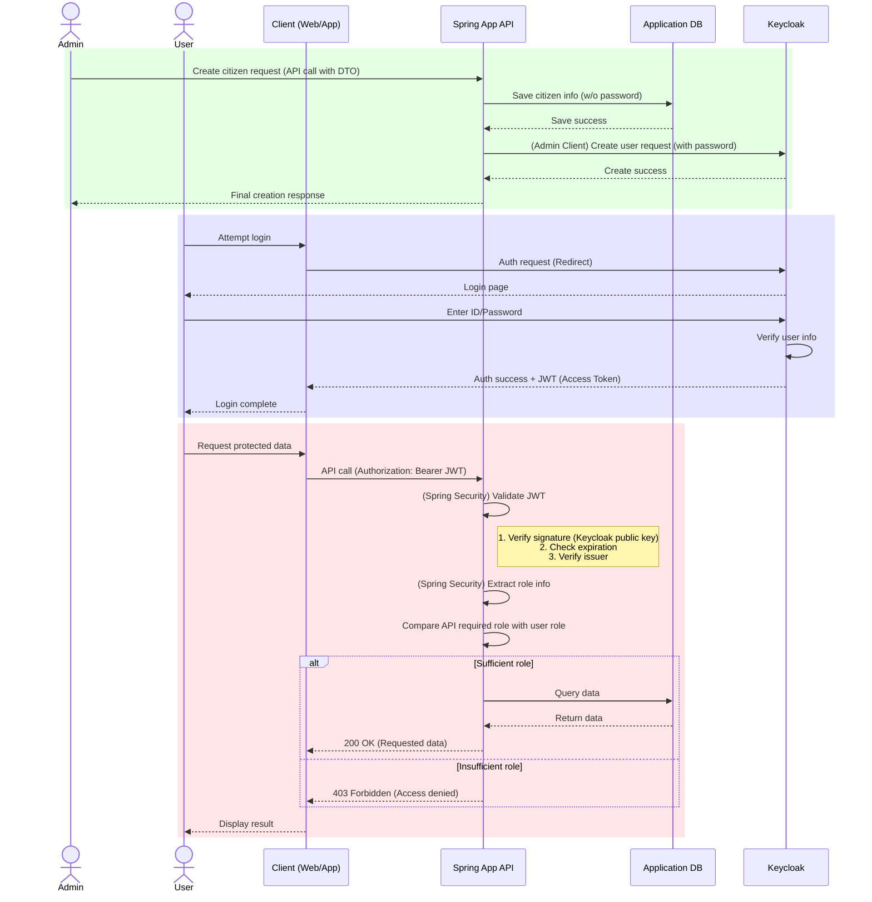

# Spring Boot와 Keycloak 연동: Spring App을 Single Source of Truth로 사용하기

이 아키텍처의 핵심은 애플리케이션의 DB가 모든 사용자/권한 정보의 주인이 되며, Keycloak은 오직 인증 토큰 발급의 역할만 수행하도록 하는 것입니다. 애플리케이션에서 발생하는 모든 변경사항이 Keycloak에 동기화되는 구조입니다.

---

### 1. 전체 아키텍처 설명

이 구조는 두 가지 주요 흐름으로 나뉩니다.

1.  **관리 흐름 (Management Flow):** Spring 애플리케이션의 API를 통해 사용자(`Citizen`)나 권한을 생성/수정/삭제하면, 서비스 로직 내부에서 **Keycloak Admin Client**를 호출하여 Keycloak 서버에 동일한 변경 사항을 실시간으로 전파(동기화)합니다.
2.  **인증/인가 흐름 (Auth Flow):**
    *   **인증(Authentication):** 사용자는 클라이언트(웹/앱)를 통해 로그인을 시도할 때 Keycloak의 로그인 페이지로 리디렉션됩니다. Keycloak은 동기화된 사용자 정보를 바탕으로 신원을 확인하고 JWT(Access Token)를 발급합니다.
    *   **인가(Authorization):** 클라이언트는 발급받은 JWT를 가지고 Spring 애플리케이션의 보호된 API에 접근합니다. Spring Security는 이 토큰을 검증하고 토큰에 담긴 역할(Role) 정보를 바탕으로 API 접근 권한을 확인합니다.

#### 각 컴포넌트의 역할

*   **Spring Boot Application**:
    *   **SSoT (Single Source of Truth)**: 사용자(`Citizen`), 권한 정보의 최종 원본. 모든 정보는 이 애플리케이션의 DB에 저장됩니다.
    *   **비즈니스 로직**: CRUD를 포함한 모든 비즈니스 로직을 처리합니다.
    *   **Keycloak 동기화**: `Keycloak Admin Client`를 사용하여 DB 변경 시 Keycloak으로 데이터를 동기화하는 책임을 가집니다.
    *   **API 서버 (Resource Server)**: 클라이언트에게 데이터를 제공하는 API를 노출하며, 모든 요청의 토큰을 검증합니다.

*   **Application DB (JPA)**:
    *   `Citizen` 등 모든 원본 데이터를 영구 저장합니다. **사용자의 비밀번호는 저장하지 않습니다.**

*   **Keycloak**:
    *   **인증 서버**: 사용자 신원 확인 및 JWT 발급 전용 서버로 역할이 축소됩니다.
    *   UI를 통한 사용자/권한 직접 관리는 하지 않습니다. (Read-only 개념으로 사용)

*   **Keycloak Admin Client**:
    *   Spring 애플리케이션이 Keycloak의 Admin REST API를 쉽게 호출할 수 있도록 도와주는 Java 라이브러리입니다.

---

### 2. 핵심 구현 전략

#### 가. `build.gradle` 의존성 추가

```groovy
dependencies {
    // Spring Web, JPA, Security 기본 의존성
    implementation 'org.springframework.boot:spring-boot-starter-web'
    implementation 'org.springframework.boot:spring-boot-starter-data-jpa'
    implementation 'org.springframework.boot:spring-boot-starter-security'

    // Spring Security가 JWT 기반의 Access Token을 검증하기 위한 의존성
    implementation 'org.springframework.boot:spring-boot-starter-oauth2-resource-server'

    // Spring App에서 Keycloak 서버를 관리(사용자/권한 생성 등)하기 위한 Admin Client
    implementation 'org.keycloak:keycloak-admin-client:22.0.5' // 버전은 Keycloak 서버와 호환되는 버전을 사용
}
```

#### 나. `application.yml` 설정

```yaml
server:
  port: 8081 # 애플리케이션 포트 설정

spring:
  security:
    oauth2:
      resourceserver:
        jwt:
          # Keycloak이 발급한 토큰의 issuer-uri. Spring Security는 이 주소를 통해
          # 토큰 서명 검증에 필요한 공개키(JWKS)를 자동으로 가져옵니다.
          issuer-uri: ${KEYCLOAK_AUTH_SERVER_URL}/realms/${KEYCLOAK_REALM}

# Keycloak Admin Client를 위한 설정
keycloak:
  auth-server-url: ${KEYCLOAK_AUTH_SERVER_URL}
  realm: ${KEYCLOAK_REALM}
  client-id: ${KEYCLOAK_CLIENT_ID} # Admin 권한을 가진 클라이언트 ID
  client-secret: ${KEYCLOAK_CLIENT_SECRET} # 해당 클라이언트의 Secret
```

#### 다. 멀티 모듈을 위한 JPA 설정 (`JpaConfig.java`)

헥사고날 아키텍처와 같이 여러 모듈로 프로젝트가 구성된 경우, 메인 애플리케이션(`pro-boot`)이 다른 모듈(`pro-proxy`)에 있는 JPA 관련 클래스(`@Entity`, `JpaRepository`)를 찾지 못하는 문제가 발생합니다. 이를 해결하기 위해 별도의 설정 파일이 필요합니다.

`pro-boot` 모듈의 `config` 패키지에 아래와 같이 `JpaConfig`를 작성하여, Repository와 Entity의 위치를 Spring에게 명시적으로 알려줍니다.

```java
package com.asan.pro.boot.config;

import org.springframework.boot.autoconfigure.domain.EntityScan;
import org.springframework.context.annotation.Configuration;
import org.springframework.data.jpa.repository.config.EnableJpaAuditing;
import org.springframework.data.jpa.repository.config.EnableJpaRepositories;

@Configuration
@EnableJpaAuditing // JPA Auditing 활성화
@EnableJpaRepositories(basePackages = "com.asan.pro.proxy") // Repository 스캔 경로 지정
@EntityScan(basePackages = "com.asan.pro.proxy") // Entity 스캔 경로 지정
public class JpaConfig {
}
```

#### 라. 사용자 생성 및 동기화 예시

비밀번호는 DB에 저장하지 않고, Keycloak에 사용자를 동기화할 때만 일시적으로 사용합니다.

**API 요청 DTO (`RegisterCitizenCommand.java`)**
```java
@Getter
@Setter
public class RegisterCitizenCommand {
    private CitizenCdo citizenCdo; // email, username 등
    private String password; // DTO에만 존재하는 비밀번호
}
```

**서비스 로직 (`CitizenFlow.java`)**
```java
@Service
@Transactional
@RequiredArgsConstructor
public class CitizenFlow {
    private final CitizenLogic citizenLogic;
    private final KeycloakSyncService keycloakSyncService;

    public Citizen registerUser(CitizenCdo citizenCdo, String password) {
        // 1. 애플리케이션 DB에 Citizen 정보 저장 (비밀번호 제외)
        String id = citizenLogic.registerCitizen(citizenCdo);
        Citizen citizen = citizenLogic.findUser(id);

        // 2. Keycloak 동기화 서비스 호출 (DB 저장된 객체 + DTO의 비밀번호 전달)
        keycloakSyncService.syncUser(citizen, password);

        return citizen;
    }
}
```

**Keycloak 동기화 구현체 (`KeycloakAdminClientServiceImpl.java`)**
```java
@Service
@RequiredArgsConstructor
public class KeycloakAdminClientServiceImpl implements KeycloakSyncService {
    // ... Keycloak 객체 주입 ...

    @Override
    public void syncUser(Citizen citizen, String password) { // password를 직접 파라미터로 받음
        UserRepresentation userRep = new UserRepresentation();
        userRep.setUsername(citizen.getLoginId());
        // ... citizen 정보 설정 ...

        // Keycloak에 사용자 생성
        Response response = keycloak.realm(realm).users().create(userRep);
        String userId = CreatedResponseUtil.getCreatedId(response);

        // 비밀번호 설정 (파라미터로 받은 password 사용)
        CredentialRepresentation passwordCred = new CredentialRepresentation();
        passwordCred.setType(CredentialRepresentation.PASSWORD);
        passwordCred.setValue(password);
        keycloak.realm(realm).users().get(userId).resetPassword(passwordCred);
    }
}
```

---

### 3. 전체 흐름도 (Mermaid Chart)

(흐름도는 기존과 동일하게 유효합니다)

