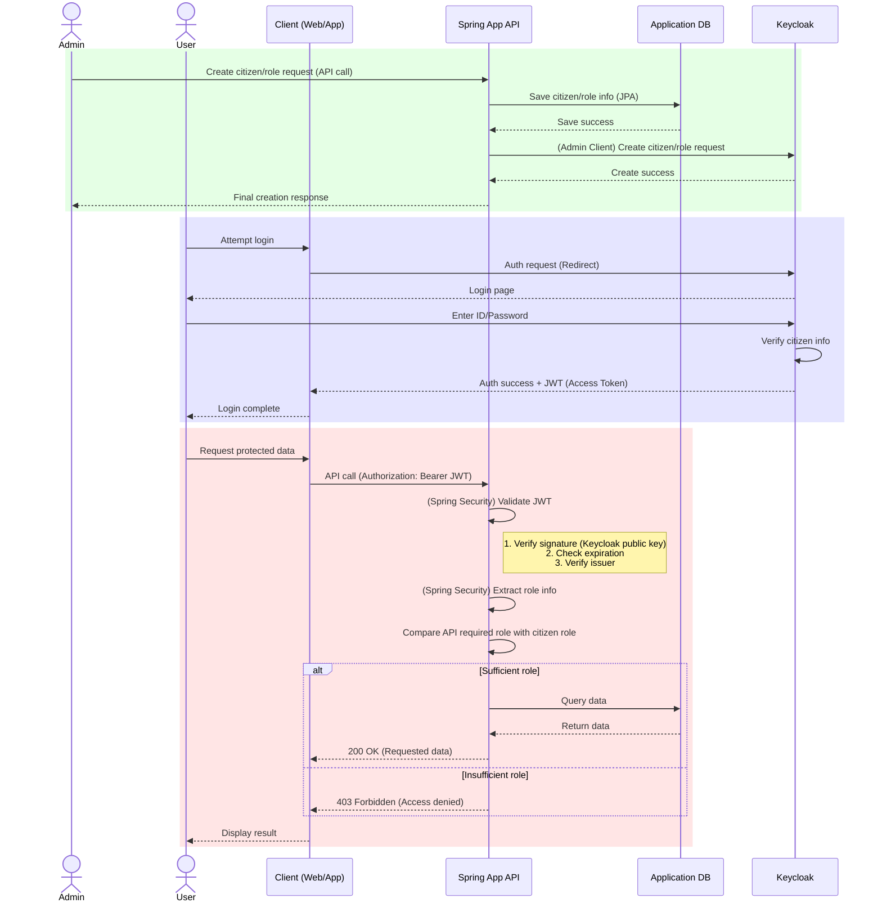

# Spring Boot와 Keycloak 연동: Spring App을 Single Source of Truth로 사용하기

요청하신 **Spring Boot JPA 애플리케이션을 사용자의 '단일 진실 공급원(Single Source of Truth)'으로 사용하여 Keycloak과 연동하는 시스템 구축 방안**에 대해 자세히 설명합니다.

이 아키텍처의 핵심은 애플리케이션의 DB가 모든 사용자/권한 정보의 주인이 되며, Keycloak은 오직 인증 토큰 발급의 역할만 수행하도록 하는 것입니다. 애플리케이션에서 발생하는 모든 변경사항이 Keycloak에 동기화되는 구조입니다.

---

### 1. 전체 아키텍처 설명

이 구조는 두 가지 주요 흐름으로 나뉩니다.

1.  **관리 흐름 (Management Flow):** Spring 애플리케이션의 API를 통해 사용자나 권한을 생성/수정/삭제하면, 서비스 로직 내부에서 **Keycloak Admin Client**를 호출하여 Keycloak 서버에 동일한 변경 사항을 실시간으로 전파(동기화)합니다.
2.  **인증/인가 흐름 (Auth Flow):**
    *   **인증(Authentication):** 사용자는 클라이언트(웹/앱)를 통해 로그인을 시도할 때 Keycloak의 로그인 페이지로 리디렉션됩니다. Keycloak은 동기화된 사용자 정보를 바탕으로 신원을 확인하고 JWT(Access Token)를 발급합니다.
    *   **인가(Authorization):** 클라이언트는 발급받은 JWT를 가지고 Spring 애플리케이션의 보호된 API에 접근합니다. Spring Security는 이 토큰을 검증하고 토큰에 담긴 역할(Role) 정보를 바탕으로 API 접근 권한을 확인합니다.

#### 각 컴포넌트의 역할

*   **Spring Boot Application**:
    *   **SSoT (Single Source of Truth)**: 사용자, 권한 정보의 최종 원본. 모든 정보는 이 애플리케이션의 DB에 저장됩니다.
    *   **비즈니스 로직**: CRUD를 포함한 모든 비즈니스 로직을 처리합니다.
    *   **Keycloak 동기화**: `Keycloak Admin Client`를 사용하여 DB 변경 시 Keycloak으로 데이터를 동기화하는 책임을 가집니다.
    *   **API 서버**: 클라이언트에게 데이터를 제공하는 API를 노출합니다.

*   **Application DB (JPA)**:
    *   사용자, 권한 등 모든 원본 데이터를 영구 저장합니다.

*   **Keycloak**:
    *   **인증 서버**: 사용자 신원 확인 및 JWT 발급 전용 서버로 역할이 축소됩니다.
    *   UI를 통한 사용자/권한 직접 관리는 하지 않습니다. (Read-only 개념으로 사용)

*   **Keycloak Admin Client**:
    *   Spring 애플리케이션이 Keycloak의 Admin REST API를 쉽게 호출할 수 있도록 도와주는 Java 라이브러리입니다. 서비스 로직에 포함되어 DB 트랜잭션 성공 후 Keycloak API를 호출하는 역할을 수행합니다.

---

### 2. 핵심 구현 전략

#### 가. `build.gradle` 의존성 추가

Keycloak과 연동하기 위해 다음 의존성들이 필요합니다.

```groovy
dependencies {
    // Spring Web, JPA, Security 기본 의존성
    implementation 'org.springframework.boot:spring-boot-starter-web'
    implementation 'org.springframework.boot:spring-boot-starter-data-jpa'
    implementation 'org.springframework.boot:spring-boot-starter-security'

    // Spring Security가 JWT 기반의 Access Token을 검증하기 위한 의존성
    implementation 'org.springframework.boot:spring-boot-starter-oauth2-resource-server'

    // Spring App에서 Keycloak 서버를 관리(사용자/권한 생성 등)하기 위한 Admin Client
    implementation 'org.keycloak:keycloak-admin-client:22.0.5' // 버전은 Keycloak 서버와 호환되는 버전을 사용하세요.

    // 기타: DB 드라이버 등
    runtimeOnly 'com.h2database:h2'
}
```

#### 나. `application.yml` 설정

Spring Security가 토큰을 검증할 때 필요한 정보와, Admin Client가 Keycloak 서버에 연결할 때 필요한 정보를 모두 설정합니다.

```yaml
spring:
  security:
    oauth2:
      resourceserver:
        jwt:
          # Keycloak이 발급한 토큰의 issuer-uri. Spring Security는 이 주소를 통해
          # 토큰 서명 검증에 필요한 공개키(JWKS)를 자동으로 가져옵니다.
          issuer-uri: http://localhost:8080/realms/your-realm-name

# Keycloak Admin Client를 위한 설정
keycloak:
  auth-server-url: http://localhost:8080
  realm: your-realm-name
  client-id: your-client-id # Admin 권한을 가진 클라이언트 ID
  client-secret: your-client-secret # 해당 클라이언트의 Secret
  grant-type: client_credentials
```

*   **`spring.security.oauth2.resourceserver.jwt.issuer-uri`**: 리소스 서버(우리 Spring 앱)가 JWT 토큰의 유효성을 검증하기 위해 사용하는 설정입니다.
*   **`keycloak.*`**: `KeycloakAdminClient`가 Keycloak 서버에 연결하여 관리 작업을 수행하기 위해 사용하는 설정입니다. 여기서 사용하는 `client-id`는 Keycloak에서 `realm-management` 클라이언트의 역할을 할당받은 특수 클라이언트여야 합니다.

#### 다. Keycloak 동기화 서비스 구현

사용자/권한 정보가 DB에 저장된 직후, 해당 정보를 Keycloak에 전송하는 서비스 로직을 구현합니다.

**KeycloakAdminClient 설정 Bean**
```java
@Configuration
public class KeycloakConfig {

    @Value("${keycloak.auth-server-url}")
    private String serverUrl;
    @Value("${keycloak.realm}")
    private String realm;
    @Value("${keycloak.client-id}")
    private String clientId;
    @Value("${keycloak.client-secret}")
    private String clientSecret;

    @Bean
    public Keycloak keycloak() {
        return KeycloakBuilder.builder()
                .serverUrl(serverUrl)
                .realm(realm)
                .grantType(OAuth2Constants.CLIENT_CREDENTIALS)
                .clientId(clientId)
                .clientSecret(clientSecret)
                .build();
    }
}
```

**사용자 생성 및 동기화 예시**
```java
@Service
@RequiredArgsConstructor
@Transactional
public class UserService {

    private final UserRepository userRepository;
    private final Keycloak keycloak; // 설정 Bean 주입
    
    @Value("${keycloak.realm}")
    private String realm;

    public User createUser(UserDto userDto) {
        // 1. Spring App DB에 사용자 저장
        User newUser = new User(userDto.getUsername(), userDto.getEmail());
        userRepository.save(newUser);

        // 2. Keycloak에 사용자 동기화
        try {
            // UserRepresentation 객체 생성
            UserRepresentation userRepresentation = new UserRepresentation();
            userRepresentation.setUsername(userDto.getUsername());
            userRepresentation.setEmail(userDto.getEmail());
            userRepresentation.setEnabled(true);

            // Keycloak에 사용자 생성 API 호출
            Response response = keycloak.realm(realm).users().create(userRepresentation);
            
            // 생성된 사용자의 ID 가져오기
            String userId = CreatedResponseUtil.getCreatedId(response);

            // 초기 비밀번호 설정
            CredentialRepresentation passwordCred = new CredentialRepresentation();
            passwordCred.setTemporary(false);
            passwordCred.setType(CredentialRepresentation.PASSWORD);
            passwordCred.setValue(userDto.getPassword());

            keycloak.realm(realm).users().get(userId).resetPassword(passwordCred);

            // 권한(Role) 할당 로직 (필요 시)
            // ...

        } catch (Exception e) {
            // 동기화 실패 시 롤백 처리 또는 예외 처리
            // @Transactional에 의해 DB 저장도 롤백됨
            throw new RuntimeException("Keycloak citizen creation failed", e);
        }
        
        return newUser;
    }
}
```
> **중요**: DB 저장과 Keycloak 동기화는 하나의 트랜잭션으로 묶여야 합니다. 만약 Keycloak 동기화가 실패하면 DB에 저장된 사용자 정보도 롤백되어야 데이터 정합성이 유지됩니다. `@Transactional` 어노테이션이 이 역할을 수행합니다.

---

### 3. 전체 흐름도 (Mermaid Chart)

요청하신 전체 흐름을 시퀀스 다이어그램으로 표현하면 다음과 같습니다.


